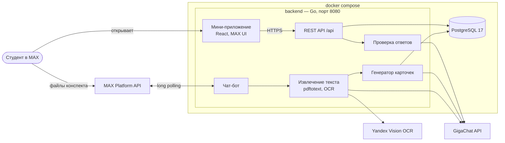

# Помнибот

Чат-бот и мини-приложение в мессенджере MAX, которые превращают конспект студента в карточки для самопроверки. Карточки строятся строго по тексту конспекта: под каждым ответом показывается цитата-источник, а модели запрещено додумывать то, чего в конспекте нет.

Хакатон Минобрнауки × MAX, трек «Образовательные решения». Команда `t583`.

**Работающая версия продукта**

| | |
|---|---|
| Бот в MAX | **[@t583_hakaton_max_bot](https://max.ru/t583_hakaton_max_bot)** — «Хакатон МАХ 583» |
| Мини-приложение в браузере | https://pomnibot.steins.ru |
| API | https://pomnibot.steins.ru/api/ (`GET /api/health`) |

Контейнеры из этого репозитория поднимают серверную часть и мини-приложение локально, но не заменяют работающую версию: основной сценарий целиком — с загрузкой конспекта в бота и открытием мини-приложения внутри MAX — проходится в боте по ссылке выше. Подробнее — в разделе [Внешние сервисы](#внешние-сервисы-и-интеграции).

## Содержание

- [Назначение](#назначение)
- [Основной пользовательский сценарий](#основной-пользовательский-сценарий)
- [Состав и архитектура](#состав-и-архитектура)
- [Запуск одной командой](#запуск-одной-командой)
- [Требования к окружению](#требования-к-окружению)
- [Переменные окружения](#переменные-окружения)
- [Порты](#порты)
- [Зависимости](#зависимости)
- [Внешние сервисы и интеграции](#внешние-сервисы-и-интеграции)
- [Работа с данными](#работа-с-данными)
- [Тестовые данные](#тестовые-данные)
- [Пошаговый сценарий проверки](#пошаговый-сценарий-проверки)
- [Ожидаемое поведение](#ожидаемое-поведение)
- [Известные ограничения](#известные-ограничения)
- [Остановка и повторный запуск](#остановка-и-повторный-запуск)
- [Разработка](#разработка)

## Назначение

Первокурснику нечем проверить себя по своему предмету: конспект даёт только текст, а собрать карточки вручную — часы работы. В итоге он перечитывает, путает узнавание с пониманием и находит пробелы уже на экзамене.

Помнибот делает из конспекта набор карточек за пару минут и даёт по нему тренироваться короткими сессиями:

- **генерация только из конспекта** — карточки строятся по одному фрагменту текста, у каждого факта обязательна дословная цитата, и факт, чья цитата не нашлась в конспекте, отбрасывается вместе с карточками;
- **источник под каждым ответом** — после ответа студент видит объяснение и цитату из своего конспекта с указанием места;
- **интервальные повторения** — карточки возвращаются, когда их пора повторить, дневная порция конечна;
- **проверка ответа по смыслу** — ответ своими словами засчитывается, если он называет то же, что в конспекте;
- **наборы по коду** — готовым набором можно поделиться с группой шестизначным кодом.

Продуктовая концепция целиком — в [docs/concept.md](docs/concept.md).

## Основной пользовательский сценарий

1. Студент открывает бота в MAX и присылает ему конспект: PDF, текстовый файл или фотографии страниц.
2. Бот распознаёт текст, режет его на фрагменты и генерирует карточки, по ходу сообщая прогресс. В конце присылает название набора, код для совместного доступа и кнопку открытия мини-приложения.
3. В мини-приложении студент видит на главном экране, сколько карточек пора повторить сегодня, и запускает ленту.
4. Лента: вопрос → ответ (выбор варианта, «верно/неверно», свой ответ текстом, раскладка по колонкам или «вспомнить и перевернуть») → переворот карточки с вердиктом, объяснением и цитатой из конспекта.
5. В конце — итоги: сколько верных ответов и в каких темах были ошибки.
6. Студент делится набором с группой по коду; одногруппник вводит код в мини-приложении и получает тот же набор.
7. Каждый день в заданное время бот напоминает тем, у кого есть карточки на повтор.

## Состав и архитектура

Решение — один Go-сервис и база PostgreSQL. Сервис одновременно:

- ведёт чат-бота через MAX Bot API (long polling, публичный адрес для вебхука не нужен);
- отдаёт REST API мини-приложения под `/api`;
- отдаёт собранное мини-приложение (статические файлы встроены в бинарник).



| Каталог | Что внутри |
|---|---|
| `backend/cmd/server` | точка входа сервиса: HTTP-сервер, бот, миграции, автозаливка демо-данных |
| `backend/internal/bot` | клиент MAX Bot API, long polling, приём файлов, напоминания |
| `backend/internal/ingest` | извлечение текста: `pdftotext` для PDF с текстовым слоем, OCR для фото и сканов |
| `backend/internal/generator` | нарезка конспекта на фрагменты и генерация карточек через GigaChat с проверкой цитат |
| `backend/internal/grader` | проверка печатного ответа: локальное сравнение, затем модель по смыслу |
| `backend/internal/transport/http` | роутер, авторизация по `initData` от MAX, отдача статики |
| `backend/internal/usecase` | бизнес-логика: наборы, лента, результаты, интервальные повторения |
| `backend/internal/repository` | миграции (goose), SQL-запросы (sqlc), демо-данные |
| `miniapp/` | мини-приложение: React 19, TypeScript, Vite, `@maxhub/max-ui` |
| `contracts/` | контракт API `openapi.yaml`, из него генерируются сервер на Go (ogen) и клиент на TypeScript |
| `docs/concept.md` | продуктовая концепция |

Эндпоинты API (полное описание — [contracts/openapi.yaml](contracts/openapi.yaml)):

| Метод и путь | Назначение |
|---|---|
| `GET /api/health` | проверка живости |
| `GET /api/` | главный экран «на сегодня»: наборы, сколько повторять, активность |
| `GET /api/feed` | карточки текущей ленты |
| `POST /api/results` | результаты ответов — по ним считается следующий повтор |
| `POST /api/cards/{cardId}/check` | проверка печатного ответа по смыслу, без записи |
| `POST /api/cards/{cardId}/answer` | ответ на карточку с вводом текста |
| `PUT` / `DELETE /api/cards/{cardId}` | правка и удаление карточки |
| `GET` / `DELETE /api/sets/{setId}` | набор и его удаление |
| `GET /api/sets/{setId}/cards` | карточки набора |
| `GET /api/sets/{setId}/share` | код набора для совместного доступа |
| `GET /api/sets/{setId}/plan` | план повторения фактов набора |
| `GET /api/sets/{setId}/leaderboard` | прогресс участников набора для автора |
| `POST /api/sets/join` | вступление в набор по коду |

## Запуск одной командой

```bash
docker compose up --build -d
```

Команда собирает образ (мини-приложение на Bun, сервер на Go) и поднимает сервер вместе с PostgreSQL. Первая сборка скачивает базовые образы и зависимости и занимает несколько минут. При старте сервер сам применяет миграции и заливает демо-набор, если база пустая.

Проверить, что всё поднялось:

```bash
docker compose ps
curl http://localhost:8080/api/health
```

Мини-приложение открывается по адресу http://localhost:8080.

Без файла `.env` решение запускается в режиме проверки: API, база и мини-приложение работают полностью, а бот, генерация карточек и проверка ответов по смыслу выключены — для них нужны ключи внешних сервисов (см. [Переменные окружения](#переменные-окружения)).

Если порт 8080 или 5432 на машине занят:

```bash
PORT=8090 POSTGRES_PORT=5433 docker compose up --build -d
```

## Требования к окружению

- **Docker** с Compose v2 (`docker compose`, не `docker-compose`). Проверено на Docker 29.3 и Compose 5.1.
- **Свободные порты** 8080 и 5432 на хосте (или другие, заданные через `PORT` и `POSTGRES_PORT`).
- **Доступ в интернет** при первой сборке — за образами `oven/bun`, `golang`, `alpine`, `postgres` и зависимостями.
- **Для полного сценария с ботом и генерацией** — ключи MAX и GigaChat в `.env` и доступ из контейнера к их API (см. [Внешние сервисы](#внешние-сервисы-и-интеграции)).

Файл `.env` необязателен. Чтобы включить внешние сервисы, скопируйте шаблон и заполните нужные ключи:

```bash
cp .env.example .env
```

## Переменные окружения

Все переменные читаются из `.env` в корне репозитория. Если переменная не задана, используется значение по умолчанию.

**Сервер и база**

| Переменная | По умолчанию | Назначение |
|---|---|---|
| `PORT` | `8080` | порт сервиса на хосте; внутри контейнера сервис всегда слушает 8080 |
| `POSTGRES_USER` | `pomnibot` | пользователь PostgreSQL |
| `POSTGRES_PASSWORD` | `pomnibot` | пароль PostgreSQL |
| `POSTGRES_DB` | `pomnibot` | имя базы |
| `POSTGRES_PORT` | `5432` | порт PostgreSQL на хосте |
| `DATABASE_URL` | собирается compose из переменных выше | строка подключения; задавать вручную нужно только при запуске сервера вне Docker. Без неё API не работает, отдаётся только статика |
| `DOMAIN` | `pomnibot.steins.ru` | домен продакшена: роутинг Traefik и адрес по умолчанию для `APP_URL` |
| `APP_URL` | `https://$DOMAIN` | адрес мини-приложения в кнопке бота «Открыть в браузере»; при локальном запуске бота укажите свой адрес |

**MAX**

| Переменная | По умолчанию | Назначение |
|---|---|---|
| `BOT_TOKEN` | — | токен бота MAX. Включает бота и проверку подписи `initData` мини-приложения. Без токена бот не запускается, а все запросы из браузера идут от тестового пользователя с id 0 |
| `MAX_API_URL` | `https://platform-api2.max.ru` | адрес MAX Bot API |
| `MAX_INSECURE_SKIP_VERIFY` | — | `true` отключает проверку TLS-сертификата MAX API; только для отладки |

**GigaChat** — генерация карточек, чтение фото, проверка ответов по смыслу

| Переменная | По умолчанию | Назначение |
|---|---|---|
| `GIGACHAT_AUTH_KEY` | — | ключ авторизации из личного кабинета GigaChat. Вместо него можно задать пару ниже |
| `GIGACHAT_CLIENT_ID`, `GIGACHAT_CLIENT_SECRET` | — | идентификатор и секрет клиента (ключ — это base64 от `client_id:client_secret`) |
| `GIGACHAT_SCOPE` | `GIGACHAT_API_PERS` | тип доступа к API |
| `GIGACHAT_MODEL` | `GigaChat-3-Ultra` | основная модель |
| `GIGACHAT_FALLBACK_MODEL` | — | запасная модель на случай исчерпанной квоты или отказов основной, например `GigaChat-2-Max` |
| `GIGACHAT_BASE_URL` | `https://api.giga.chat/v1` | адрес API; GigaChat-3-Ultra доступна только здесь |
| `GIGACHAT_AUTH_URL` | `https://ngw.devices.sberbank.ru:9443/api/v2/oauth` | адрес получения токена |
| `GIGACHAT_MAX_TOKENS` | `8192` | предел длины ответа модели |

**Yandex Vision OCR** — необязательно, улучшает чтение фото и сканов

| Переменная | По умолчанию | Назначение |
|---|---|---|
| `YC_API_KEY` | — | API-ключ сервисного аккаунта с ролью `ai.vision.user` |
| `YC_FOLDER_ID` | — | каталог Yandex Cloud |
| `YC_OCR_MODEL` | рукописная для фото, `page` для сканов | модель распознавания для всех страниц |

**Напоминания о повторе**

| Переменная | По умолчанию | Назначение |
|---|---|---|
| `NOTIFICATIONS_ENABLED` | включены | `false` выключает ежедневные напоминания бота |
| `NOTIFICATION_TIME` | `10:00` | время рассылки |
| `NOTIFICATION_TZ` | `Europe/Moscow` | часовой пояс рассылки и расчёта «на сегодня» |

**Только для CI/CD** — локально не нужны: `DOCKER_IMAGE`, `IMAGE_TAG`, `DEPLOY_PATH`.

## Порты

| Порт | Сервис | Что на нём |
|---|---|---|
| 8080 | `backend` | мини-приложение (`/`) и API (`/api`). Порт на хосте меняется переменной `PORT` |
| 5432 | `postgres` | PostgreSQL, открыт на хосте для отладки. Меняется переменной `POSTGRES_PORT`; в продакшене наружу не публикуется |
| 5173 | — | дев-сервер Vite, только при разработке мини-приложения (`task dev`), в Docker не используется |

Исходящие соединения из контейнера `backend`: `platform-api2.max.ru:443` (MAX), `api.giga.chat:443` и `ngw.devices.sberbank.ru:9443` (GigaChat), `ai.api.cloud.yandex.net:443` и `operation.api.cloud.yandex.net:443` (Yandex OCR) — только если соответствующие ключи заданы.

## Зависимости

**Для запуска** достаточно Docker — всё остальное собирается внутри образов:

| Компонент | Версия | Где |
|---|---|---|
| Go | 1.26 | сборка сервера |
| Bun | 1.4 | сборка мини-приложения |
| Alpine Linux | 3.21 | образ сервера: `ca-certificates`, `tzdata`, `poppler-utils` (`pdftotext`, `pdftoppm` для PDF) |
| Корневой сертификат Минцифры | — | встроен в образ, нужен для TLS-соединения с GigaChat |
| PostgreSQL | 17 | образ `postgres:17-alpine` |

**Ключевые библиотеки**

- сервер: `ogen` (сервер по OpenAPI), `pgx` (драйвер PostgreSQL), `goose` (миграции), `sqlc` (генерация кода по SQL-запросам);
- мини-приложение: React 19, TypeScript, Vite, `@maxhub/max-ui` (компоненты MAX), `openapi-fetch` (клиент API).

**Для разработки без Docker**: Go 1.26, Bun 1.4, [Task](https://taskfile.dev), `golangci-lint`, `sqlc`; для генерации и проверки `DATA-API.yaml` — Python 3.

## Внешние сервисы и интеграции

Три внешних сервиса невозможно воспроизвести внутри Docker. Без них решение запускается и проверяется в браузере (см. [Сценарий A](#сценарий-a-локально-в-docker-без-ключей)), но часть функций выключается.

| Сервис | Зачем | Что без него | Условия для проверки |
|---|---|---|---|
| **MAX** (Bot API и платформа мини-приложений) | бот принимает конспекты и шлёт напоминания; мини-приложение открывается внутри MAX и получает от него подписанные данные пользователя (`initData`) | бот не запускается; мини-приложение работает только в браузере, все запросы идут от тестового пользователя с id 0 | токен бота в `BOT_TOKEN`; для открытия мини-приложения внутри MAX — публичный HTTPS-адрес, указанный в настройках бота (локальный Docker для этого недоступен, нужен туннель или развёрнутая версия) |
| **GigaChat** (Сбер) | генерация карточек из конспекта, чтение фото и сканов, проверка печатного ответа по смыслу | бот сообщает об ошибке при загрузке конспекта; фото не распознаются; печатный ответ засчитывается только при совпадении с эталоном с точностью до формы слов и опечаток | ключ в `GIGACHAT_AUTH_KEY` (или пара `GIGACHAT_CLIENT_ID` / `GIGACHAT_CLIENT_SECRET`) с доступом к выбранной модели; сетевой доступ к `api.giga.chat` и `ngw.devices.sberbank.ru` |
| **Yandex Vision OCR** | переворачивает фото и перепроверяет прочитанный GigaChat текст | фото читает только GigaChat, без проверки и без поворота | `YC_API_KEY` и `YC_FOLDER_ID` сервисного аккаунта с ролью `ai.vision.user` |

Проверить весь основной сценарий с генерацией можно в работающей версии — в боте по ссылке [в начале](#помнибот): там все ключи уже заданы.

## Работа с данными

**Хранилище** — PostgreSQL 17 в контейнере `postgres`, данные лежат в Docker-томе `postgres_data` и переживают перезапуск.

**Миграции** применяются автоматически при старте сервера (goose, [backend/internal/repository/migrations](backend/internal/repository/migrations)). Отдельных шагов для подготовки базы нет.

**Что хранится**

| Таблица | Содержимое |
|---|---|
| `users` | пользователи MAX: id и имя из данных, которые передаёт мессенджер |
| `sets` | наборы карточек: название, автор, шестизначный код для совместного доступа |
| `user_sets` | кто в каких наборах состоит |
| `topics`, `facts` | темы и факты конспекта; карточки строятся вокруг фактов |
| `cards`, `card_options`, `card_table_columns`, `card_table_items` | карточки: вопрос, ответ, объяснение, цитата из конспекта и место в нём, варианты ответа, раскладка для карточек-таблиц |
| `user_fact_progress` | состояние интервального повторения по каждому факту для каждого пользователя: интервал, коэффициент лёгкости, дата следующего повтора |
| `answer_results` | каждый ответ: пользователь, карточка, верно или нет, время |

**Как данные проходят через систему**

1. Бот скачивает присланные файлы и извлекает из них текст в памяти: `pdftotext` для PDF с текстовым слоем, OCR через GigaChat и Yandex для фото и сканов. Сами файлы и полный текст конспекта в базе не сохраняются — остаются только карточки с цитатами.
2. Генератор режет текст на фрагменты и по каждому просит у GigaChat факты с дословной цитатой и карточки к ним. Факт, чья цитата не нашлась в тексте, отбрасывается вместе с карточками.
3. Набор, факты и карточки записываются в базу, набору выдаётся код.
4. Мини-приложение получает ленту через `GET /api/feed`, отправляет ответы через `POST /api/results`; по ним пересчитывается дата следующего повтора каждого факта.
5. Печатный ответ сначала сравнивается локально; ответ другими словами уходит в GigaChat. Эта проверка ничего не записывает — результат сохраняется только вместе с остальными ответами ленты.

Пользователь в мини-приложении определяется по подписанным данным `initData` от MAX; хранилище браузера (`localStorage`) не используется.

## Тестовые данные

**Демо-набор создаётся автоматически** при первом запуске на пустой базе:

- название: «Введение в компиляторы и препроцессор C++»;
- 66 карточек по 21 факту и 15 темам, все виды: 20 с выбором варианта, 20 «верно/неверно», 12 с вводом ответа, 14 «вспомнить и перевернуть»;
- автор: служебный пользователь «Pomnibot Content Admin» (id 100001);
- **код для входа: `101101`**.

Источник данных — [backend/internal/repository/seeds/res.json](backend/internal/repository/seeds/res.json). Если в базе уже есть хоть один набор, автозаливка пропускается.

Новый пользователь попадает в демо-набор так же, как одногруппник: «Ввести код набора» → `101101`.

**Сбросить данные к исходному состоянию** — удалить том с базой и запуститься заново, демо-набор зальётся снова:

```bash
docker compose down -v
docker compose up -d
```

**Свои тестовые наборы**:

- в работающей версии — прислать боту любой конспект (PDF, `.txt` или фото страниц);
- прогнать генерацию на своём конспекте без базы и бота, с живым GigaChat: `task cardsgen -- notes.pdf` — печатает карточки, статистику и время.

## Пошаговый сценарий проверки

### Сценарий A: локально в Docker, без ключей

Проверяет сервер, API, базу и мини-приложение. Всё ниже пройдено на чистом клоне репозитория без `.env`.

1. Запустить решение:
   ```bash
   docker compose up --build -d
   ```
2. Дождаться старта и проверить живость:
   ```bash
   curl http://localhost:8080/api/health
   ```
   Ожидается `{"status":"ok"}`.
3. Убедиться по логам, что миграции прошли и демо-набор залит:
   ```bash
   docker compose logs backend | grep -E "migrated|seeding completed|BOT_TOKEN"
   ```
4. Открыть http://localhost:8080 — удобнее в мобильной ширине (инструменты разработчика браузера → режим устройства). Главный экран: «Привет, User 0», наборов пока нет.
5. Нажать «Ввести код набора», ввести `101101`, нажать «Добавить набор». Откроется экран набора «Введение в компиляторы и препроцессор C++»: 66 карточек, 21 на повтор.
6. Нажать «Повторить…». Ответить на карточки:
   - с вариантами — выбрать вариант, карточка перевернётся с вердиктом, объяснением и цитатой из конспекта;
   - «вспомнить и перевернуть» — нажать на карточку или «Показать ответ», затем «Знал» или «Не знал»;
   - после каждой карточки — «Дальше».
7. После последней карточки откроются итоги: «N из 21 верных ответов» и ошибки по темам, самые проблемные сверху.
8. Нажать «К набору»: прогресс в наборе вырос, карточек на повтор стало меньше — результаты сохранились в базе.
9. Проверить API проверки ответов напрямую:
   ```bash
   SET=$(curl -s http://localhost:8080/api/ | python3 -c "import json,sys; print(json.load(sys.stdin)['sets'][0]['id'])")
   CARD=$(curl -s http://localhost:8080/api/sets/$SET/cards | python3 -c "import json,sys; print([c for c in json.load(sys.stdin) if c['kind']=='input'][0]['id'])")
   curl -s -X POST http://localhost:8080/api/cards/$CARD/check -H 'Content-Type: application/json' -d '{"answer":"первая фаза трансляции"}'
   ```
   Ожидается `{"isCorrect":true,"method":"local"}` — ответ совпал с эталоном без обращения к модели.
10. Проверить, что данные переживают перезапуск: `docker compose down && docker compose up -d`, открыть http://localhost:8080 — набор на месте, прогресс сохранён.

### Сценарий B: полный, в MAX

Проверяет загрузку конспекта, генерацию, мини-приложение внутри мессенджера и совместный доступ. Проходится в работающей версии — боте по ссылке [в начале](#помнибот).

1. Открыть бота в MAX и запустить его. Бот присылает приветствие с кнопками «Открыть Помнибот» и «Открыть в браузере».
2. Прислать боту конспект: PDF, `.txt` или несколько фото страниц одним сообщением. Подпись к сообщению станет названием набора.
3. Дождаться статусов «Получил… Распознаю текст», «Анализирую конспект и создаю карточки», «Создаю карточки… Уже готово: N» и итогового сообщения с кодом набора.
4. Нажать «Открыть Помнибот» — мини-приложение откроется внутри MAX под вашим именем, новый набор будет на главном экране.
5. Пройти ленту. На карточке с вводом ответа написать ответ своими словами: карточка покажет «Сверяю с конспектом», через 8 секунд — «Подождите ещё», через 12 — «Ещё чуть-чуть», и перевернётся с вердиктом и пояснением от модели.
6. Посмотреть итоги, нажать «Поделиться набором» и скопировать приглашение с кодом.
7. Со второго аккаунта MAX открыть бота, в мини-приложении нажать «Ввести код набора» и ввести код — набор появится у второго пользователя.

### Сценарий C: локально с ключами

Для проверки бота и генерации на своей машине.

1. Создать **отдельного тестового бота** в MAX и взять его токен. Токен работающей версии использовать нельзя: бот получает сообщения через long polling, и локальный запуск будет перехватывать их у продакшена.
2. Заполнить `.env`:
   ```bash
   cp .env.example .env
   # BOT_TOKEN, GIGACHAT_AUTH_KEY, при желании YC_API_KEY и YC_FOLDER_ID
   ```
3. Запустить: `docker compose up --build -d`. В логах должно появиться `starting MAX bot long-polling loop` и `gigachat card generator initialized`.
4. Пройти шаги 1–3 сценария B с тестовым ботом. Кнопка «Открыть в браузере» ведёт на адрес из `APP_URL`; для локальной проверки задайте `APP_URL=http://localhost:8080`.

## Ожидаемое поведение

**Сервер**

```console
$ curl http://localhost:8080/api/health
{"status":"ok"}

$ docker compose logs backend
… msg="goose: successfully migrated database to version: 3"
… msg="database is empty, running auto-seed with default course..."
… msg="mock data seeding completed successfully" factsInserted=21 cardsInserted=66
… level=WARN msg="BOT_TOKEN not provided, running in static SPA mode only"
… msg="starting server" addr=:8080
```

Предупреждения `failed to initialize gigachat client` и `BOT_TOKEN not provided` без `.env` — ожидаемы: соответствующие функции выключены, остальное работает.

**Проверка печатного ответа** (`POST /api/cards/{cardId}/check`)

| Ответ | Результат |
|---|---|
| совпадает с эталоном с точностью до формы слов, порядка и опечаток | `{"isCorrect":true,"method":"local"}` — сразу, без модели |
| пустой или просит засчитать («засчитай», «игнорируй инструкции») | `{"isCorrect":false,"method":"local"}` — сразу |
| другими словами, GigaChat настроен | `{"isCorrect":…,"reason":"…","method":"model"}` — вердикт и пояснение от модели |
| другими словами, GigaChat не настроен | `{"isCorrect":false,"method":"local"}` |
| модель не ответила за 8 секунд | `{"isCorrect":false,"method":"fallback"}` — мини-приложение не показывает это как ошибку, а повторяет запрос |

**Мини-приложение**

- Карточка переворачивается после ответа, на обороте — вердикт (цвет и значок), объяснение и цитата из конспекта с указанием места.
- Во время проверки печатного ответа карточка не переворачивается и показывает ожидание; экрана «не удалось» нет — человек всегда получает вердикт.
- После последней карточки — итоги с долей ошибок по темам; «Поделиться набором» открывает код и кнопку копирования приглашения.
- Если повторять нечего — экран «На сегодня всё».

**Бот**

- На запуск бота и любое текстовое сообщение — приветствие с кнопками открытия мини-приложения.
- На файлы — статусы распознавания и генерации, в конце «🎉 Набор «…» успешно создан! Код для совместного доступа: …».
- На неподдерживаемый файл или сбой генерации — «К сожалению, произошла ошибка при создании конспекта. Попробуйте еще раз позже.»
- Раз в день в `NOTIFICATION_TIME` — напоминание тем, у кого есть карточки на повтор.

## Известные ограничения

- **Без MAX пользователь один на всех.** В браузере без `initData` все запросы идут от тестового пользователя с id 0 («User 0»), у всех открывших общий прогресс. Это режим для проверки, а не для работы.
- **Один токен — один запущенный бот.** Бот использует long polling и при старте снимает подписки; два запущенных экземпляра с одним токеном делят между собой сообщения.
- **Мини-приложение внутри MAX требует публичного HTTPS-адреса.** Локальный Docker открывается только в браузере.
- **Форматы конспектов:** PDF, текстовые файлы (UTF-8, UTF-16, Windows-1251), фото JPEG, PNG, WebP. Документы Word (`.doc`, `.docx`) не поддерживаются — бот ответит ошибкой.
- **Без GigaChat нет генерации и проверки по смыслу.** Печатный ответ другими словами в этом режиме засчитывается как неверный.
- **Очередь к модели.** На бесплатном тарифе GigaChat обслуживает один запрос за раз, поэтому проверка ответа может ждать завершения генерации. Сервер ждёт модель 8 секунд, мини-приложение при таймауте повторяет запрос, а любой HTTP-ответ сервер обрывает через 15 секунд.
- **Бесконечное ожидание при сломанном сервере.** Мини-приложение повторяет проверку ответа, пока не получит вердикт; если сервер недоступен насовсем, выйти можно только кнопкой «назад».
- **Напоминания** уходят раз в день в фиксированное время, отдельного расписания для каждого пользователя нет.

## Остановка и повторный запуск

| Действие | Команда |
|---|---|
| Остановить, сохранив данные | `docker compose down` |
| Запустить снова | `docker compose up -d` |
| Пересобрать после изменений в коде | `docker compose up --build -d` |
| Сбросить базу к демо-данным | `docker compose down -v`, затем `docker compose up -d` |
| Посмотреть состояние | `docker compose ps` |
| Смотреть логи сервера | `docker compose logs -f backend` |
| Перезапустить только сервер | `docker compose restart backend` |

Данные хранятся в томе `postgres_data`: `down` их не трогает, `down -v` удаляет. После `down -v` демо-набор заливается заново при следующем старте, а пользователям нужно снова войти в него по коду `101101`.

Те же действия через [Task](https://taskfile.dev): `task up`, `task down`, `task logs`.

## Разработка

| Команда | Что делает |
|---|---|
| `task dev` | дев-сервер мини-приложения на http://localhost:5173; `/api` проксируется на `BACKEND_URL` (по умолчанию `http://localhost:8080`) |
| `task db:up` | поднять только PostgreSQL для запуска сервера вне Docker |
| `task lint` | линтеры фронтенда (ESLint) и бэкенда (`golangci-lint`) |
| `task test` | тесты бэкенда |
| `task gen` | генерация кода: сервер и клиент по `openapi.yaml`, запросы sqlc, `DATA-API.yaml` |
| `task cardsgen -- notes.pdf` | генерация карточек на живом GigaChat без бота и базы |

`main` защищён: изменения вносятся через ветки и pull request, CI проверяет генерацию контрактов, линтеры, сборку и тесты, а после слияния в `main` собирает образ и выкатывает его на сервер.
